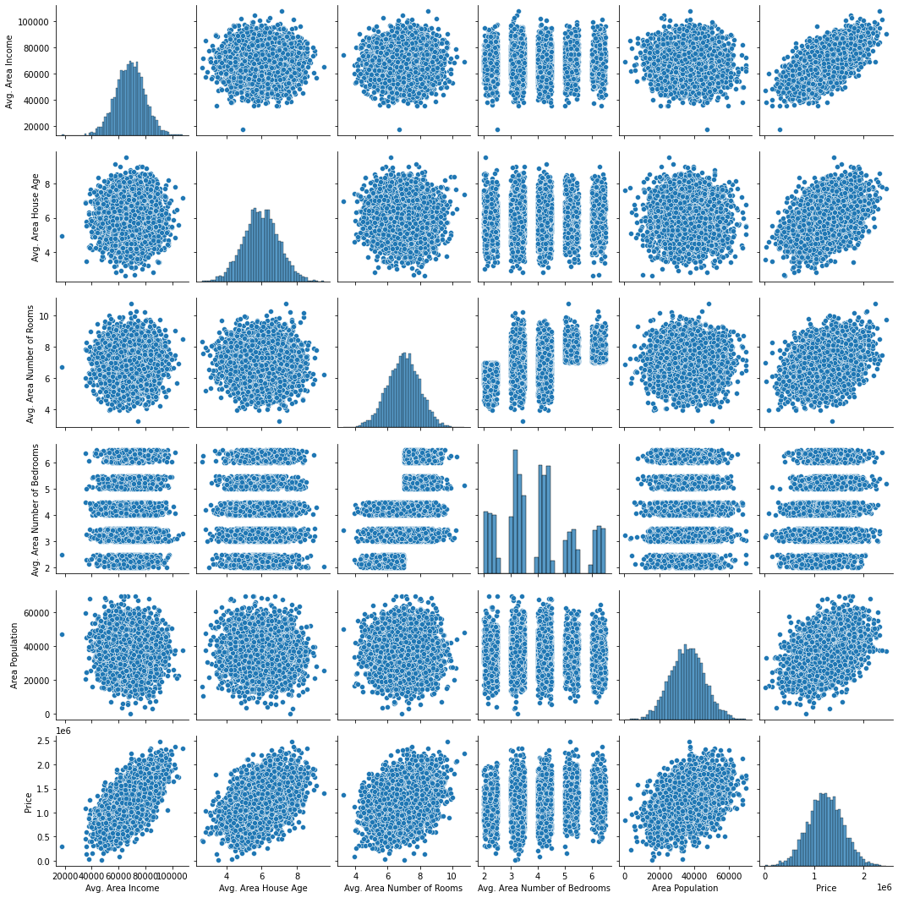
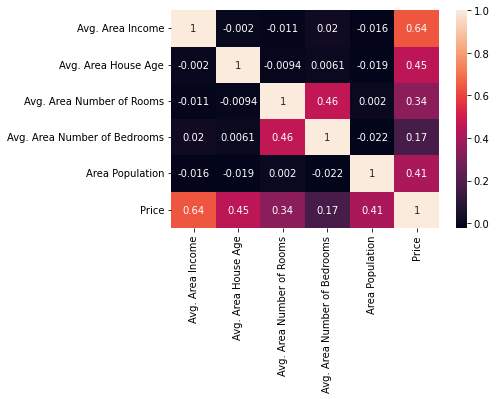

# Housing Price - Regression Techniques

This program uses linear and logistic regression to predict USA housing prices.


### Dataset

[kaggle - USA Housing](https://www.kaggle.com/datasets/vedavyasv/usa-housing)


# EDA

#### Info on Dataset

```
RangeIndex: 5000 entries, 0 to 4999
Data columns (total 7 columns):
 #   Column                        Non-Null Count  Dtype  
---  ------                        --------------  -----  
 0   Avg. Area Income              5000 non-null   float64
 1   Avg. Area House Age           5000 non-null   float64
 2   Avg. Area Number of Rooms     5000 non-null   float64
 3   Avg. Area Number of Bedrooms  5000 non-null   float64
 4   Area Population               5000 non-null   float64
 5   Price                         5000 non-null   float64
 6   Address                       5000 non-null   object
dtypes: float64(6), object(1)
memory usage: 273.6+ KB
```

#### Pairplot Histogram

<p align="center">
    
</p>

#### Correlation heatmap

<p align="center">
    
</p>


### Models

- Linear Regression
- Polynomial Regression

### Usage

The program usage:

```
usage: main.py [-h] [-i INPUTS [INPUTS ...]] [-c CSV_FILE] [-m MODEL]

optional arguments:
  -h, --help            show this help message and exit
  -i INPUTS [INPUTS ...], --inputs INPUTS [INPUTS ...]
                        inputs housing data
  -c CSV_FILE, --csv-file CSV_FILE
                        csv file with housing data
  -m MODEL, --model MODEL
                        csv file with housing datatype of the regression model
```

#### Example usage

This command will use an input file (which contains housing features) and linear regression model to predict the housing prices. The metrics and results are also saved in output folder.

```bash
python main.py -c input/inputs.csv -m linear
```

This command will use an manual housing features input and use polynomial regression model to predict the housing prices. The metrics and results are also saved in output folder.

```bash
python main.py -i 79545 5 7 4 23086 -m polynomial
```
